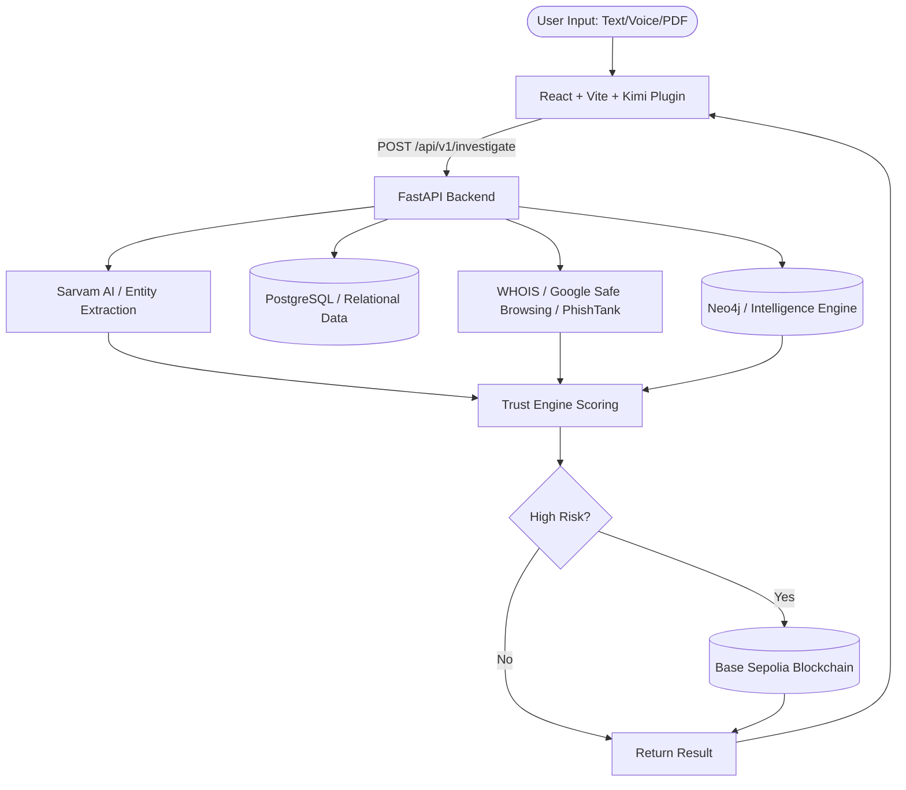

# TrustNet - Kimi AI Accelerated Application

TrustNet is a real-time job offer fraud investigation platform built for Indian job seekers. It processes unstructured inputs (text, voice, documents) using advanced AI entity extraction, cross-references government databases (MCA) and OSINT sources, and utilizes a Neo4j knowledge graph to detect scam rings. TrustNet provides a final "Trust Score" and publishes confirmed high-risk entities to a Base blockchain registry.

## Overall Architecture & Data Flow



## Technology Stack

- **Frontend:** React 18/19, Vite, Tailwind CSS, Zustand, React Router
- **Backend:** FastAPI, Python 3.11+, SQLAlchemy, Pydantic, Celery
- **Databases:** PostgreSQL (Relational), Neo4j (Graph), Redis (Caching/Rate Limiting)
- **AI & Integrations:** Sarvam AI (NLP/STT), WhoisXML, Google Safe Browsing, PhishTank
- **Blockchain:** Base Sepolia, Solidity (TrustNetRegistry)

## Kimi AI Integration

The application leverages Kimi AI to accelerate the frontend development and debugging process. The `app` directory uses the `kimi-plugin-inspect-react` Vite plugin, which allows for advanced real-time component inspection, state debugging, and seamless iteration while developing React components. This AI-assisted workflow greatly improves the speed of UI/UX iteration.

## How to Start the Development Environment

You need to run both the frontend and backend servers concurrently.

### Prerequisites
- Node.js (v20+)
- Python (v3.11+)
- Docker & Docker Compose (for PostgreSQL & Redis)

### 1. Start the Backend
```bash
cd trustnet-backend
# Copy the example environment file
cp .env.example .env 
# Start backing services (PostgreSQL, Redis)
docker-compose up -d
# Create a virtual environment and install dependencies
python -m venv venv
source venv/bin/activate  # Or `venv\Scripts\activate` on Windows
pip install -r requirements.txt
# Run migrations
alembic upgrade head
# Start the FastAPI development server
uvicorn main:app --reload --port 8000
```

### 2. Start the Frontend
```bash
cd app
# Install dependencies
npm install
# Start the Vite development server
npm run dev
```

The frontend will be available at `http://localhost:5173` and the backend API at `http://localhost:8000`. You can access the backend Swagger documentation at `http://localhost:8000/docs`.
